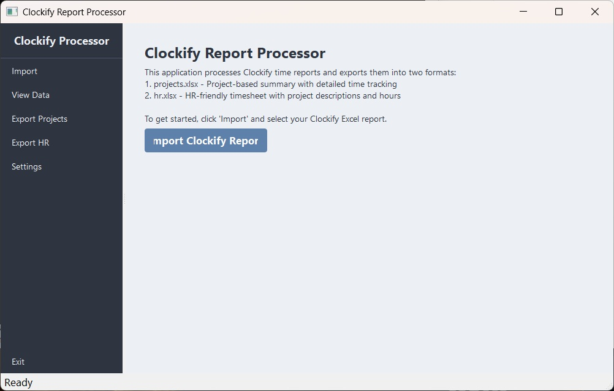

# Clockify Report Processor

[](https://www.python.org/downloads/)
[](https://pypi.org/project/PyQt5/)
[](https://pandas.pydata.org/)
[](https://openpyxl.readthedocs.io/)
[](LICENSE)

## 📋 Table of Contents

- [Overview](#overview)
- [Features](#features)
- [Technical Architecture](#technical-architecture)
- [Installation](#installation)
- [Usage Guide](#usage-guide)
- [Data Processing Workflow](#data-processing-workflow)
- [File Formats](#file-formats)
- [Development](#development)
- [Contributing](#contributing)
- [License](#license)

## 🔍 Overview

Clockify Report Processor is a powerful desktop application designed to transform raw Clockify time tracking exports into structured, business-ready reports. The application provides a modern, responsive user interface built with PyQt5 and leverages pandas for efficient data processing.



This tool bridges the gap between Clockify's raw time tracking data and the specialized reporting needs of project management and HR departments by generating two distinct report formats:

1. **Project-based reports** - Detailed time tracking organized by projects
2. **HR-friendly timesheets** - Simplified reports with project descriptions and hours

## ✨ Features

### Core Functionality

- **Import Clockify Reports**: Load Excel exports from Clockify time tracking system
- **Data Preview**: View and verify imported time tracking data before processing
- **Project-Based Export**: Generate detailed project-based reports with individual sheets for each project
- **HR-Friendly Export**: Create simplified timesheets suitable for HR departments
- **Progress Tracking**: Real-time progress bars for all data processing operations

### User Interface

- **Responsive Design**: Adapts to different window sizes and screen resolutions
- **Modern Nordic Theme**: Clean, professional UI with the Nord color palette
- **Intuitive Navigation**: Sidebar menu for easy access to all functions
- **Status Updates**: Informative status bar with operation feedback
- **Interactive Data Grid**: Preview imported data with sortable columns

### Data Processing

- **Intelligent Format Detection**: Automatically handles different Clockify export formats
- **Duration Calculations**: Precise time calculations with support for various time formats
- **Data Aggregation**: Summarizes time entries by project and description
- **Multi-sheet Reports**: Organizes data into separate sheets for better readability
- **Totals and Subtotals**: Automatically calculates and displays time totals

## 🏗️ Technical Architecture

### Component Structure

```
Clockify Report Processor
├── UI Components
│   ├── Main Window (ResponsiveApp)
│   ├── Sidebar Navigation
│   ├── Content Area
│   ├── Data Preview Table
│   └── Progress & Status Indicators
├── Data Processing
│   ├── Excel Import Module
│   ├── Data Transformation Engine
│   ├── Project Report Generator
│   └── HR Report Generator
└── Utilities
    ├── Excel Export Module
    └── Format Conversion Tools
```

### Technology Stack

- **Python 3.8+**: Core programming language
- **PyQt5 (v5.15.9)**: UI framework for desktop application
  - QMainWindow: Main application container
  - QSplitter: Responsive layout management
  - QTableWidget: Data preview display
  - QFileDialog: File selection dialogs
  - QProgressBar: Operation progress visualization
- **pandas (v2.0.0)**: Data manipulation and analysis
  - DataFrame: Primary data structure
  - ExcelWriter: Multi-sheet Excel export
  - read_excel: Import functionality
- **openpyxl (v3.1.2)**: Excel file handling backend

### Design Patterns

- **Model-View-Controller (MVC)**: Separation of data, UI, and business logic
- **Single Responsibility Principle**: Each class handles one aspect of functionality
- **Factory Method**: For creating different report types
- **Observer Pattern**: UI updates based on data processing events

## 📥 Installation

### Prerequisites

- Python 3.8 or higher
- pip (Python package manager)
- Windows operating system (primary support)

### Step-by-Step Installation

1. **Clone the repository**

   ```bash
   git clone https://github.com/AmirHosseinMoloudi/clockify-report-processor.git
   cd clockify-report-processor
   ```

2. **Create a virtual environment (optional but recommended)**

   ```bash
   python -m venv venv

   # On Windows
   venv\Scripts\activate

   # On macOS/Linux
   source venv/bin/activate
   ```

3. **Install dependencies**

   ```bash
   pip install -r requirements.txt
   ```

   This will install:

   - PyQt5 (v5.15.9) - UI framework
   - pandas (v2.0.0) - Data processing
   - openpyxl (v3.1.2) - Excel file handling

### Quick Start (Windows)

For Windows users, you can simply run:

```bash
run_app.bat
```

This batch file will:

1. Upgrade pip to the latest version
2. Install all required dependencies
3. Launch the application

Alternatively, use `start_app.bat` if you've already installed dependencies.

## 🚀 Usage Guide

### Importing Clockify Data

1. Launch the application using `python src/main.py` or `start_app.bat`
2. Click the **Import** button in the sidebar or the main content area
3. Select your Clockify Excel export file (.xlsx or .xls)
4. The application will load and display a preview of the data

### Generating Project Reports

1. After importing data, click the **Export Projects** button
2. Choose a location to save the projects.xlsx file
3. The application will process the data and create:
   - A sheet for each unique project
   - Time entries organized by project with descriptions
   - Duration totals for each project

### Generating HR Reports

1. After importing data, click the **Export HR** button
2. Choose a location to save the hr.xlsx file
3. The application will process the data and create:
   - A simplified timesheet format suitable for HR
   - Project entries with aggregated descriptions
   - Time totals for each project and description

## 🔄 Data Processing Workflow

### Import Process

1. **File Selection**: User selects a Clockify Excel export
2. **Data Loading**: Application reads the Excel file using pandas
3. **Format Detection**: System identifies column structure and data types
4. **Data Preview**: First 100 rows are displayed in the table view

### Project Report Generation

1. **Data Preparation**: Copy and transform the imported data
2. **Project Identification**: Extract unique project names
3. **Time Calculation**: Convert and standardize time formats
4. **Sheet Creation**: Generate individual sheets for each project
5. **Total Calculation**: Compute duration totals for each project
6. **Formatting**: Apply consistent formatting to all sheets

### HR Report Generation

1. **Data Aggregation**: Group entries by project and description
2. **Time Summation**: Calculate total time for each group
3. **Format Conversion**: Transform time values to HH:MM:SS format
4. **Sheet Organization**: Create sheets for different reporting views
5. **Total Calculation**: Add grand totals and subtotals

### Time Calculation Algorithm

The application uses a sophisticated algorithm to handle various time formats:

```python
# Convert decimal hours to HH:MM:SS format
def decimal_to_time(decimal_hours):
    if pd.isna(decimal_hours):
        return None
    hours = int(decimal_hours)
    minutes = int((decimal_hours - hours) * 60)
    seconds = int(((decimal_hours - hours) * 60 - minutes) * 60)
    return f"{hours:02d}:{minutes:02d}:{seconds:02d}"

# Calculate total duration from HH:MM:SS strings
total_duration_seconds = 0
for duration in durations:
    if pd.notna(duration) and isinstance(duration, str):
        try:
            h, m, s = map(int, duration.split(':'))
            total_duration_seconds += h * 3600 + m * 60 + s
        except (ValueError, AttributeError):
            pass
```

## 📊 File Formats

### Input Format (Clockify Export)

The application expects a standard Clockify Excel export with columns such as:

- Project
- Description
- User
- Email
- Start Date/Time
- End Date/Time
- Duration

### Output Format: projects.xlsx

```
Project | Description | User | Email | Start Date | Start Time | End Date | End Time | Duration (h)
-------------------------------------------------------------------------------------
Project A | Task description | John Doe | john@example.com | 01/05/2023 | 09:00:00 | 01/05/2023 | 17:00:00 | 08:00:00
...
Total: | | | | | | | | 40:00:00
```

Each project gets its own dedicated sheet with all time entries and a calculated total.

### Output Format: hr.xlsx

```
Project | Description | Time (h)
-----------------------------
Project A | | 16:00:00
 | Task 1 description | 08:00:00
 | Task 2 description | 08:00:00
Project B | | 24:00:00
 | Task 3 description | 16:00:00
 | Task 4 description | 08:00:00
-----------------------------
Total: | | 40:00:00
```

The HR format provides a simplified view with projects and their descriptions aggregated with calculated time totals.

## 💻 Development

### Project Structure

```
clockify/
├── app/                  # Application package
├── images/               # UI assets and images
├── src/                  # Source code
│   └── main.py           # Main application entry point
├── analyze_excel.py      # Utility for analyzing Excel files
├── analyze_excel.bat     # Batch file for Excel analysis
├── requirements.txt      # Python dependencies
├── run_app.bat           # Application launcher with dependency installation
├── start_app.bat         # Simple application launcher
└── README.md             # Project documentation
```

### Key Classes and Functions

- **ResponsiveApp**: Main application window and controller
  - `__init__()`: Initializes the application UI and data structures
  - `create_sidebar()`: Builds the navigation sidebar
  - `create_content()`: Creates the main content area
  - `import_excel()`: Handles importing and parsing Clockify data
  - `display_data_preview()`: Shows imported data in the UI table
  - `export_projects()`: Generates project-based reports
  - `export_hr()`: Creates HR-friendly timesheet reports

### UI Component Hierarchy

```
ResponsiveApp (QMainWindow)
├── central_widget (QWidget)
│   ├── main_layout (QHBoxLayout)
│   │   └── splitter (QSplitter)
│   │       ├── sidebar (QWidget)
│   │       │   └── sidebar_layout (QVBoxLayout)
│   │       │       ├── title (QLabel)
│   │       │       ├── separator (QFrame)
│   │       │       ├── nav_buttons (QPushButton[])
│   │       │       └── logout_btn (QPushButton)
│   │       └── content_area (QWidget)
│   │           └── content_layout (QVBoxLayout)
│   │               ├── welcome_widget (QWidget)
│   │               ├── table_widget (QTableWidget)
│   │               ├── progress_bar (QProgressBar)
│   │               └── export_widget (QWidget)
│   │                   └── export_layout (QHBoxLayout)
│   │                       ├── export_projects_btn (QPushButton)
│   │                       └── export_hr_btn (QPushButton)
└── status_bar (QStatusBar)
```

### Styling System

The application uses QSS (Qt Style Sheets) for styling, with a Nord-inspired color palette:

```css
/* Sidebar styling */
#sidebar {
  background-color: #2e3440;
  min-width: 180px;
  max-width: 250px;
}

/* Content area styling */
#content {
  background-color: #eceff4;
}

/* Button styling */
QPushButton {
  background-color: #5e81ac;
  color: white;
  border: none;
  border-radius: 4px;
  padding: 8px 15px;
  font-weight: bold;
}
```

### Extending the Application

To add new export formats or features:

1. Create a new export method in the ResponsiveApp class
2. Add a corresponding button in the UI (sidebar and/or export section)
3. Implement the data transformation logic
4. Add error handling and progress reporting

Example of adding a new export format:

```python
def export_new_format(self):
    """Export data in a new custom format"""
    if self.clockify_data is None:
        QMessageBox.warning(self, "No Data", "Please import a Clockify report first.")
        return

    try:
        # Get save file location
        file_path, _ = QFileDialog.getSaveFileName(
            self,
            "Save New Format Report",
            "new_format.xlsx",
            "Excel Files (*.xlsx)"
        )

        if not file_path:
            return

        # Implement your custom export logic here
        # ...

        QMessageBox.information(self, "Export Complete", f"New format report exported to {file_path}")

    except Exception as e:
        QMessageBox.critical(self, "Export Error", f"Failed to export: {str(e)}")
```

## 👥 Contributing

Contributions to the Clockify Report Processor are welcome! Here's how you can contribute:

1. **Fork the repository**
2. **Create a feature branch**
   ```bash
   git checkout -b feature/amazing-feature
   ```
3. **Commit your changes**
   ```bash
   git commit -m 'Add some amazing feature'
   ```
4. **Push to the branch**
   ```bash
   git push origin feature/amazing-feature
   ```
5. **Open a Pull Request**

### Development Guidelines

- Follow PEP 8 style guidelines for Python code
- Add docstrings to all functions and classes
- Maintain the existing UI design language
- Include error handling for all user interactions
- Write unit tests for new functionality

### Testing

To test the application:

1. Create sample Clockify export files with various data structures
2. Test the import functionality with different file formats
3. Verify the export functionality produces correct output
4. Check responsive behavior by resizing the application window
5. Test error handling by providing invalid inputs

## 📄 License

This project is licensed under the MIT License - see the LICENSE file for details.

## 🔧 Troubleshooting

### Common Issues

- **ImportError: No module named 'PyQt5'**: Run `pip install -r requirements.txt` to install dependencies
- **FileNotFoundError**: Ensure you're running the application from the project root directory
- **Excel Import Errors**: Verify your Clockify export has the expected column structure
- **UI Rendering Issues**: Update your graphics drivers or try a different display resolution

### Debugging

For advanced debugging, use the included `analyze_excel.py` utility:

```bash
python analyze_excel.py path/to/your/clockify_export.xlsx
```

This will print detailed information about the Excel file structure and data types.

## 🙏 Acknowledgements

- [Clockify](https://clockify.me/) for their time tracking platform
- [PyQt5](https://www.riverbankcomputing.com/software/pyqt/) for the UI framework
- [pandas](https://pandas.pydata.org/) for powerful data processing capabilities
- [openpyxl](https://openpyxl.readthedocs.io/) for Excel file manipulation
- [Nord Theme](https://www.nordtheme.com/) for the color palette inspiration

---
